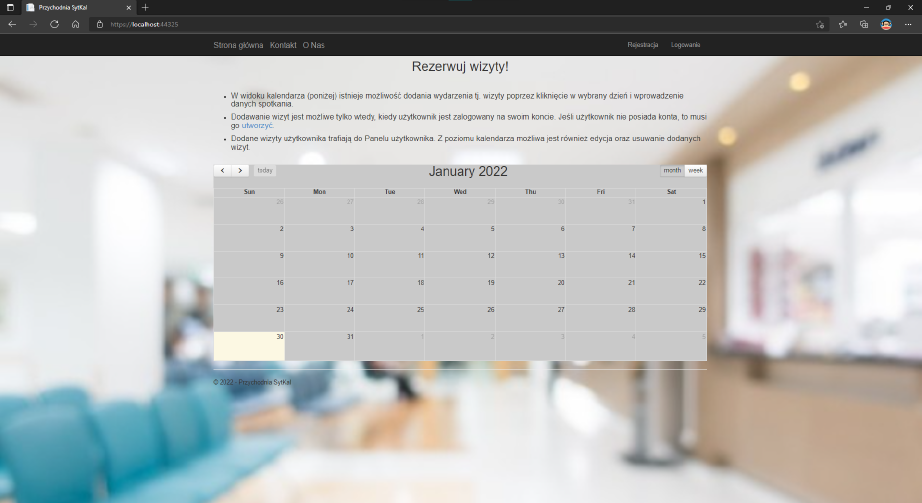
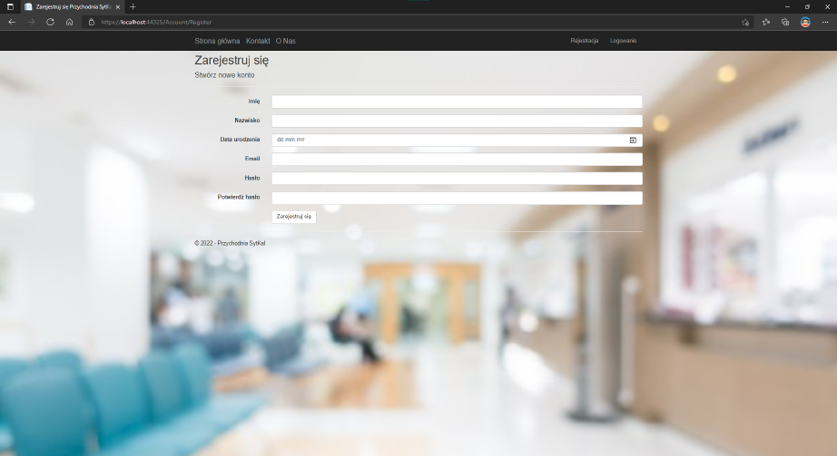
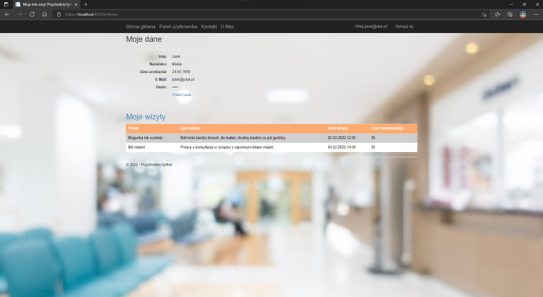
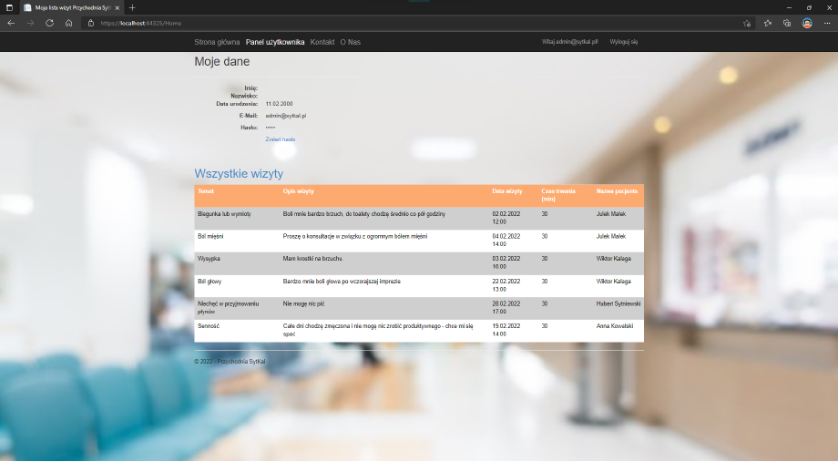
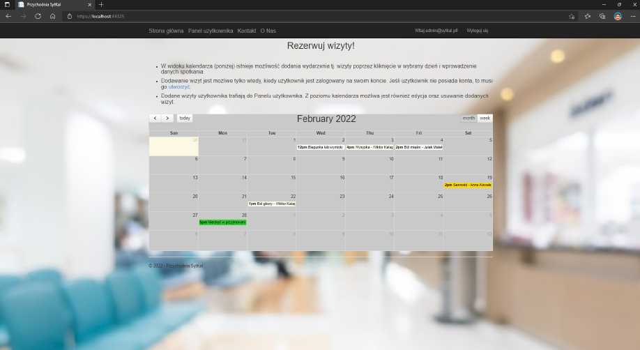

# Appointment Scheduler
The aim of this study project is to make an appointment in clinic by picking any day and time on the calendar, select aim of the appointment and describe it.
## Technologies used
- ASP .NET Framework MVC
- Bootstrap
- JavaScript Full Calendar
## Sample screenshots
### View of the main page with some general info of how using application

### Registration page

### Patient profile page and its appointments

### View of all appointments of patients within the clinic in his profile

### View of all appointments of patients within the clinic on the calendar

## Sources
- https://docs.microsoft.com/pl-pl/aspnet/mvc/overview/getting-started/introduction/getting-started
- https://fullcalendar.io/
